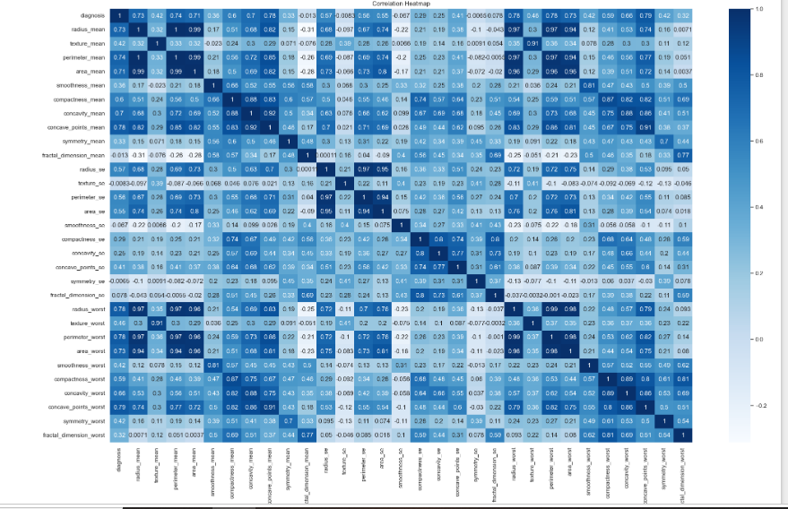

# 🩺 Breast Cancer Prediction Using Machine Learning

## 📌 Project Overview

Breast cancer is one of the most common cancers affecting women worldwide. Early diagnosis is critical for improving treatment outcomes.

This project uses Machine Learning algorithms to classify tumors as:

* Malignant (Cancerous)
* Benign (Non-Cancerous)

## 🎯 Objectives

* Build predictive machine learning models
* Compare multiple algorithms
* Identify the best-performing classifier
* Assist early breast cancer diagnosis

## 📊 Dataset

The dataset contains tumor measurements extracted from digitized breast mass images.

Target Variable:

* Diagnosis

  * M = Malignant
  * B = Benign

## 🔧 Technologies Used

* Python
* Pandas
* NumPy
* Matplotlib
* Seaborn
* Scikit-Learn
* Jupyter Notebook

## 🤖 Models Trained

* Logistic Regression
* Decision Tree
* Random Forest
* Gaussian Naive Bayes

## 📈 Results

| Model                | Accuracy |
| -------------------- | -------- |
| Logistic Regression  | 97.37%   |
| Decision Tree        | 92.98%   |
| Random Forest        | 96.49%   |
| Gaussian Naive Bayes | 97.37%   |

### Best Model

Logistic Regression achieved:

* Accuracy: 97.37%
* Cross Validation Score: 98.07%

## 🔑 Key Insights

* Tumor characteristics strongly predict cancer diagnosis.
* Logistic Regression demonstrated the best generalization performance.
* Ensemble methods improved prediction stability.
* Machine learning can support healthcare professionals in early diagnosis.

## 📸 Visualizations

### Correlation Heatmap

### Confusion Matrix

### Model Comparison

## 🚀 Future Improvements

* Hyperparameter tuning
* XGBoost implementation
* Model deployment using Streamlit
* Real-time prediction system

## 👩‍💻 Author

Victoria Ayomide

Aspiring Data Scientist | Machine Learning Enthusiast
